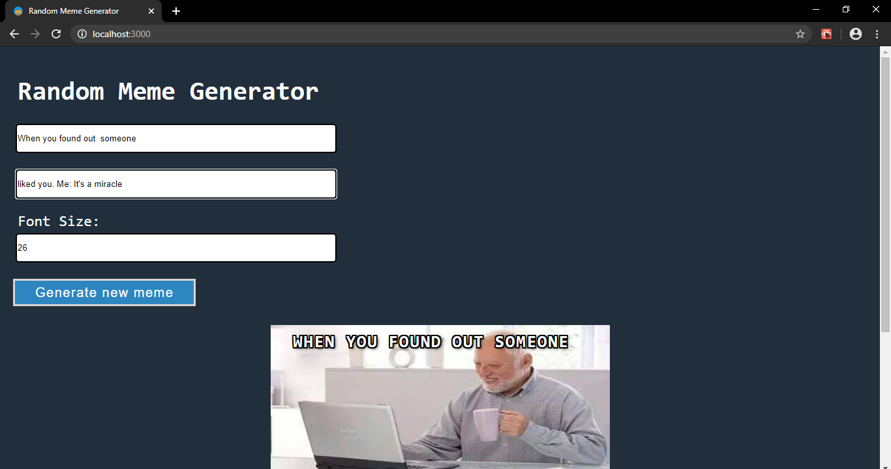
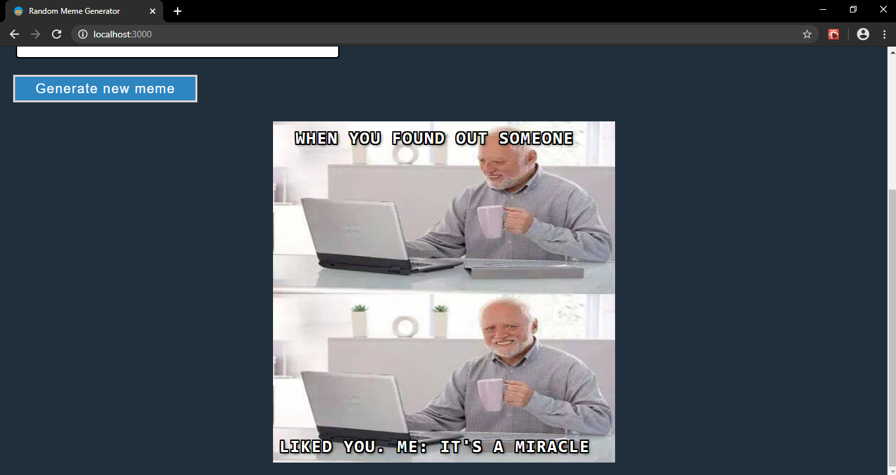

# RANDOM MEME GENERATOR IN REACT

* Purpose: My Project
* Front End: HTML5, CSS3
* Used JavaScript Library: React
* Responsive Web Design: Yes
* Type of Website: Dynamic

<h2> User Interface Screenshots </h2> 
  
    
  
  